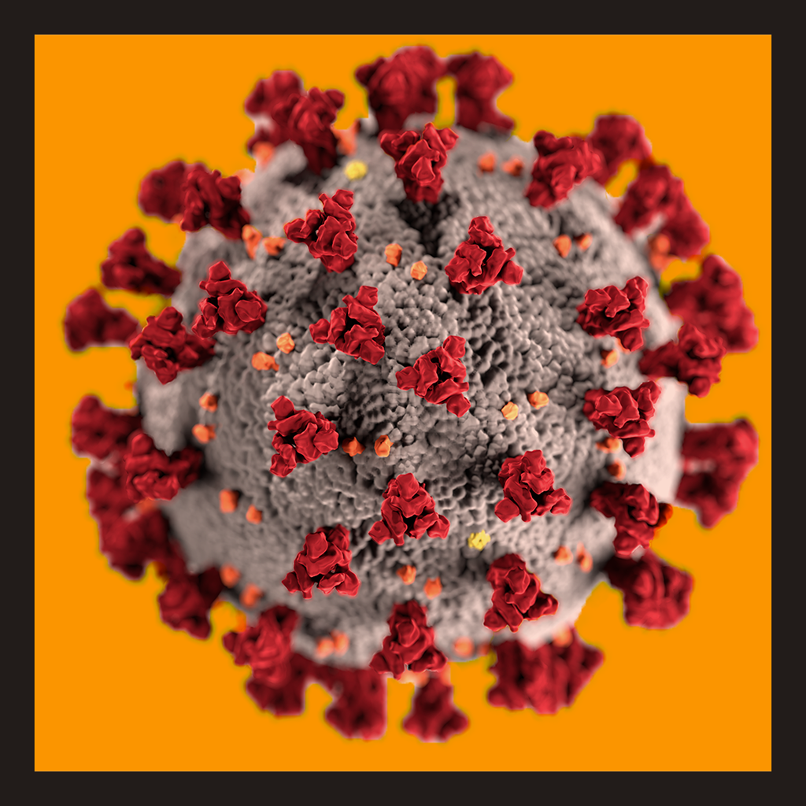
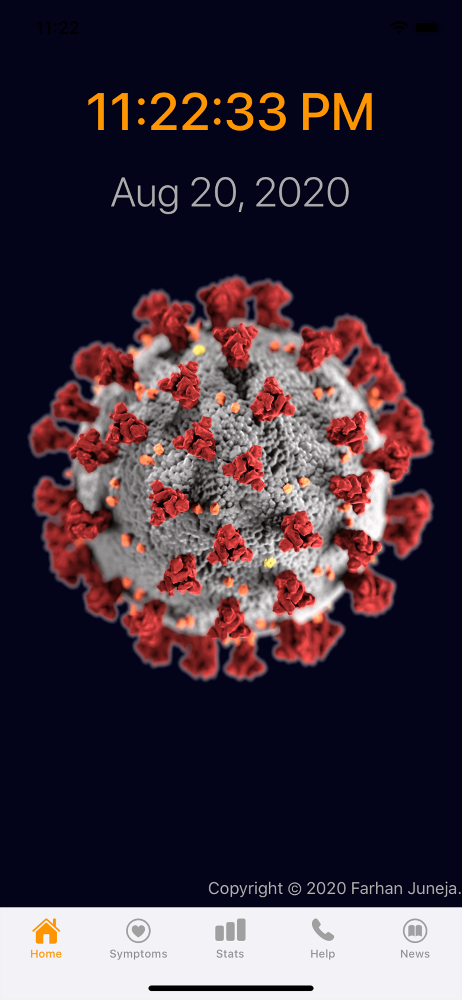
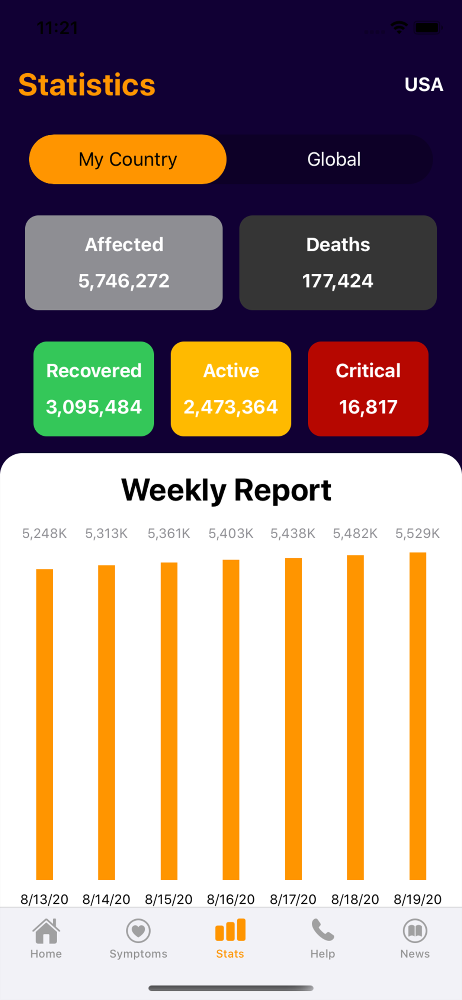
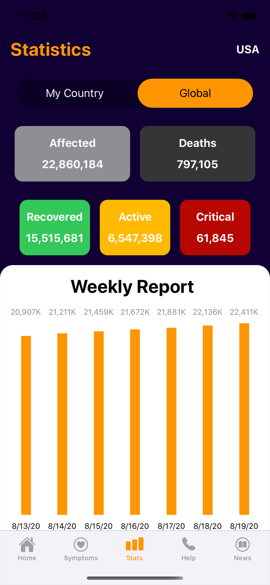
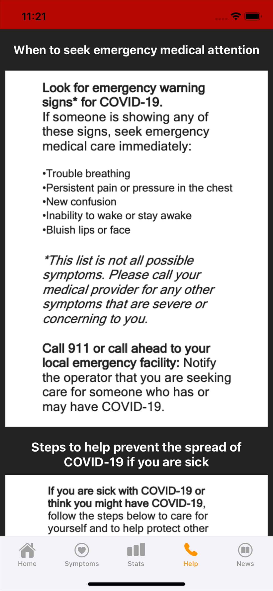
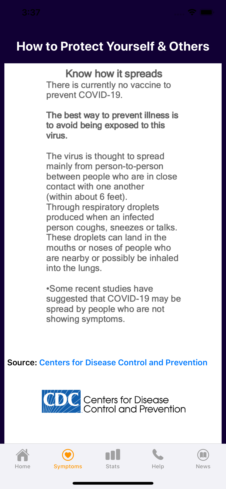
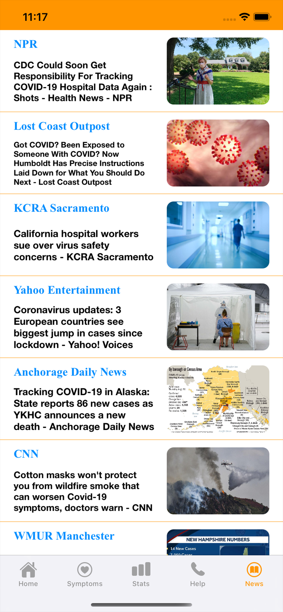
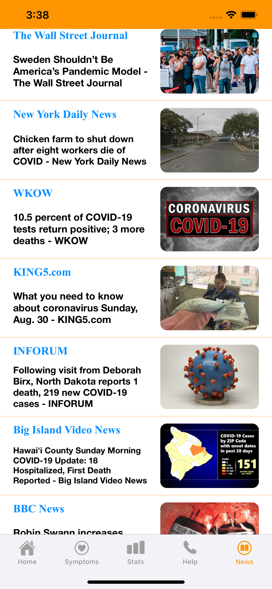

# Outbreak-Data
## Multi-Sourced data on current global outbreaks

 

This application provides essential statistical data about the COVID-19 disease along with steps to prevent and defend against it. The user may view constantly updated COVID-19 reported stats on country and global scales.   

    

   

Allows users to stay informed with continuously updated medical and health headlines from top news outlets.
